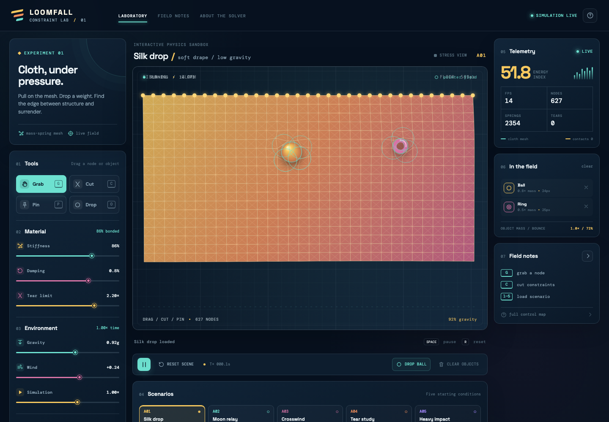

# Loomfall — Constraint Lab

Loomfall is a tactile cloth-physics laboratory for the browser. Drop a ball, cube, ring, or star onto a live fabric mesh, pull a node until it yields, pin a new anchor, and draw a cut through the springs. The point is to make the mechanics legible and immediately fun: the mesh is both a simulation and an instrument you can play.

> Static-first, dependency-light, and designed to run on GitHub Pages.



The screenshot above is a real capture of the running laboratory, including the live mesh and collision objects.

## Why it exists

Physics sandboxes are often either opaque demos or intimidating engineering tools. Loomfall sits between those extremes. Every visible change has a physical cause: gravity pulls the nodes, wind pushes the surface, damping controls the memory of movement, and the constraint network decides whether a fold holds or tears.

## What you can do

- Grab and drag cloth nodes or any object in the field.
- Pin or release individual nodes to create new anchors.
- Draw a cut path to sever structural and shear constraints.
- Drop balls, cubes, rings, and stars directly onto the mesh.
- Tune stiffness, damping, tear limit, gravity, wind, time scale, object mass, and bounce.
- Switch to stress view to see stretched constraints warm from amber to red.
- Start from six different experiments: Silk drop, Moon relay, Crosswind, Tear study, Heavy impact, and Orbit drift.
- Pause, reset, clear objects, or use keyboard shortcuts without leaving the field.
- Read live telemetry for FPS, node count, active springs, energy index, tears, and contacts.
- Launch an impact volley that drops three bodies with different trajectories.
- Capture up to five run snapshots, review observations in the archive, keep them across refreshes, and export a JSON lab log.
- Use focus mode to expand the field, with the active experiment carried through responsive resizes.
- Toggle a live **3D depth projection** (`D`) that turns cloth folds, objects, contacts, and the constraint lattice into a perspective relief without changing the stable 2D solver.
- Undo and redo field edits with `⌘/Ctrl+Z` and `⌘/Ctrl+Shift+Z`, including grabs, cuts, pins, clears, and object drops.
- Export the current canvas as a PNG directly from the transport bar for sharing a field state.
- Pause and advance one solver frame at a time with the `FRAME` control when inspecting a fold or collision.
- Let the lab auto-pause when its browser tab is hidden to avoid wasting work in the background.

## Controls

| Control | Action |
| --- | --- |
| `G` | Grab a cloth node or object |
| `C` | Cut constraints with a drag path |
| `P` | Pin or release the nearest node |
| `O` | Choose an object and click to drop it |
| `Space` | Pause or resume the simulation |
| `R` | Reset the current experiment |
| `F` | Toggle the expanded focus field |
| `D` | Toggle the 3D depth projection |
| `⌘/Ctrl+Z` | Undo the last field edit |
| `⌘/Ctrl+Shift+Z` | Redo a field edit |
| `FRAME` | Advance one frame while paused |
| `1`–`6` | Load a scenario preset |

The same actions are available through the tool panel and transport bar, so the lab is usable with a mouse, touch pointer, or keyboard.

## Devlog

The build diary lives in [`docs/devlog.md`](docs/devlog.md). It records the design decisions, experiments, and verification passes behind the laboratory rather than treating the final screenshot as the whole story.

## How the physics works

The cloth is a rectangular lattice of particles connected by three kinds of distance constraints:

1. **Structural springs** connect immediate horizontal and vertical neighbors.
2. **Shear springs** cross each cell diagonally so the fabric resists skewing.
3. **Bend springs** span two cells and keep the surface from collapsing into a single zig-zag.

Each free node is advanced with a Verlet-style integrator. Its current position and previous position provide the velocity estimate, then gravity and a time-varying wind field add external acceleration. The solver iterates the distance constraints several times per frame. Collision resolution pushes cloth nodes out of dynamic object radii and reflects their incoming velocity. Structural and shear links can break when their length crosses the selected tear limit; the cut tool marks those links inactive directly.

The render loop is independent of React state. Canvas drawing and simulation stay on a bounded frame step, while React only receives compact telemetry updates. That keeps the controls responsive without turning every particle into a component.

## Tech stack

- React + TypeScript
- Vite
- HTML Canvas 2D
- Verlet integration with iterative distance constraints
- No backend, database, API key, or runtime service

## Run locally

```bash
npm install
npm run dev
```

For a production build:

```bash
npm run build
npm run preview
```

The Vite `base: './'` setting keeps the generated `dist/` folder compatible with static hosting and GitHub Pages.

## Project notes

The five implementation directions considered before coding are documented in [`docs/design-directions.md`](docs/design-directions.md). The chosen direction is a dependable 2D Constraint Lab foundation: expressive enough to expose the physics, small enough to remain reliable as a static site, and open-ended enough for later experiments.

The Pages deployment is defined in [`.github/workflows/deploy.yml`](.github/workflows/deploy.yml). Every push to `main` typechecks, builds `dist/`, uploads the artifact, and deploys it through the GitHub Pages environment.

## Credits

Built as an original Stardance project by Loomfall Studio. The visual system, simulation, interactions, and copy are part of this project; there are no external runtime services.

## Live demo

Try the live build at [costachestefy90-source.github.io/loomfall](https://costachestefy90-source.github.io/loomfall/). The source is public at [github.com/costachestefy90-source/loomfall](https://github.com/costachestefy90-source/loomfall).
